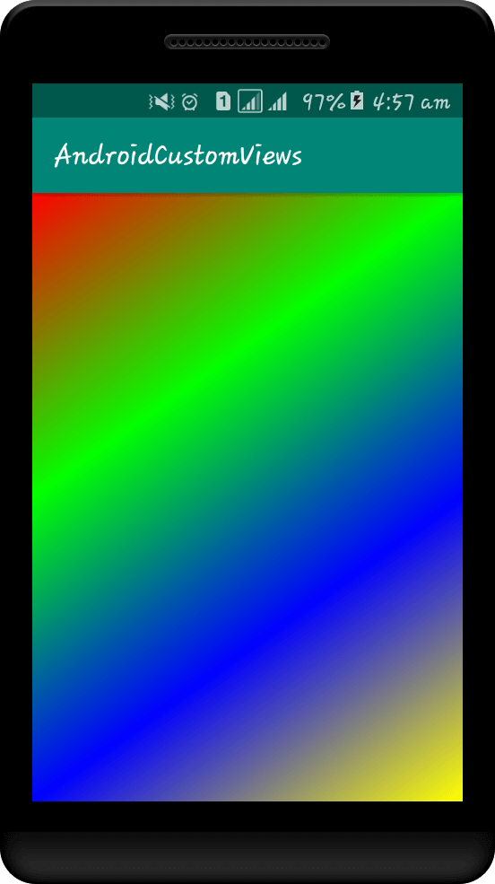
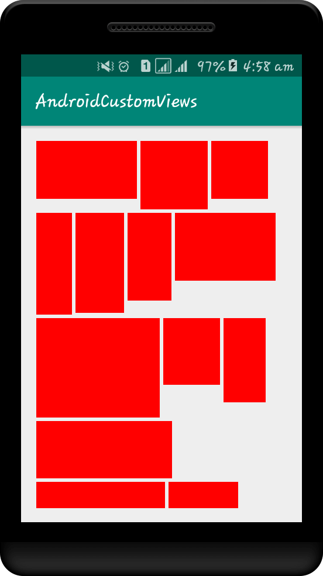
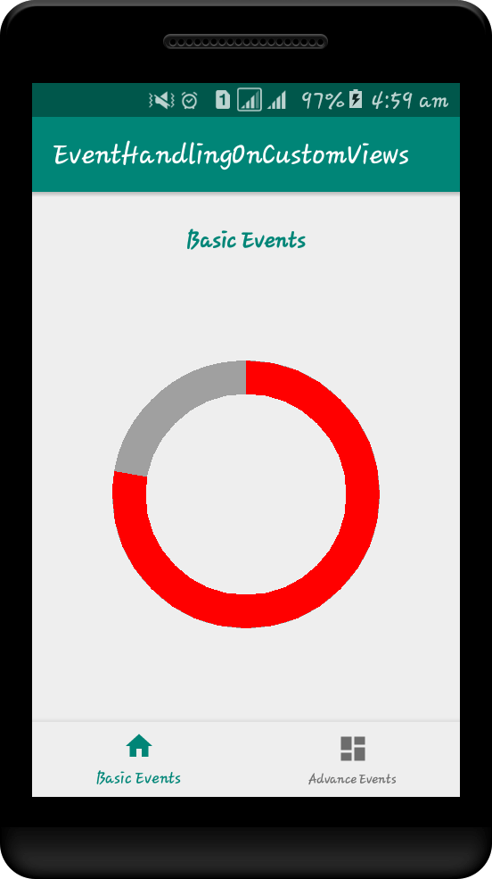
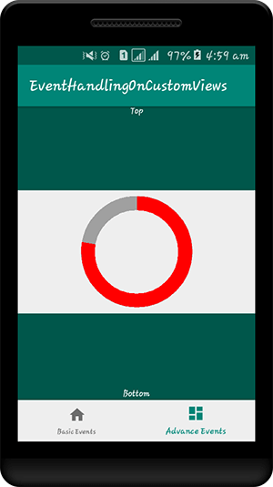

# Android Custom Views

### CustomTextView, CustomView, CustomView With Measurement, CustomView With Parameters, Custom Circular View, View Rendring

### Touch Events,Gestures, Developed In Kotlin

